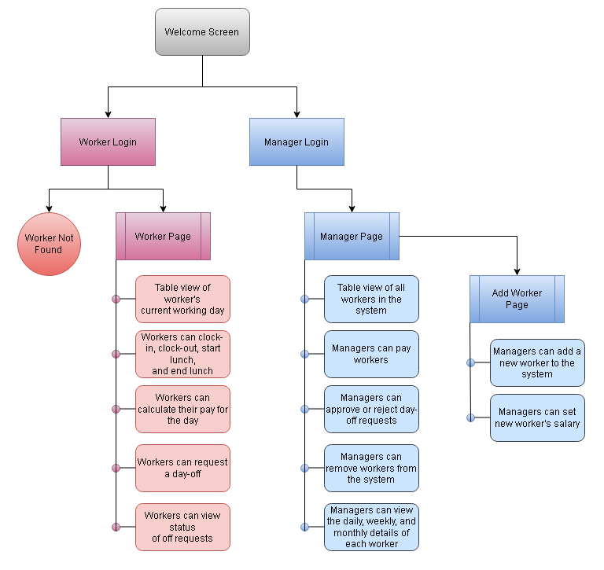

# Clock Wisdom

## Overview

Many field workers do not have an efficient way to keep track of their working time. This application allows employees to clock in, clock out, request/schedule days off and view their working hours and how much they've made so far. A manager can use this application to add and keep track of workers salary information.

## Getting Started

1. Clone the repoistory
2. Open a new terminal navigate Flask/attendanceApp
3. On the terminal type ```pip install -r requirements.txt``` or ```pip3 install -r requirements.txt``` to install the requirements for Flask.
4. Type ```app.py``` or ```python app.py``` or ```python3 app.py``` in the same terminal and press enter to start the flask.
5. Now navigate to React/attendanceapp in a new terminal.
6. Type ```npm install``` in the terminal and press enter to install all the necessary dependencies.
7. Type ```npm start``` in the terminal and press enter to launch the web app.

## Requirements

Backend Technologies:
Flask
SQLAlchemy
Jinja2

Frontend Technologies:
React

## Data Model

```
Worker Detail {
    id = 123,
    name = Ben,
    department = Subway,
    salary_hour = $20,
    salary = $400,
    salary_paid = $285,
    clockin = 2020-12-07 8:17:11,
    clockout = 2020-12-07 19:17:15,
    lunchin = 2020-12-07 15:17:14,
    lunchout = 2020-12-07 16:08:23,
    dayoff = "Sick",
}
```

```
Worker Weekly Detail{
    id = 123,
    date = 2020-12-07,
    name = Ben,
    department = subway,
    salary_hour = 20,
    salary = $400,
    salary_paid = $285,
    time = 32.047 hrs,
    dayoff_approve = Yes,
    dayoff_reject = No
}
```

```
Schedule Day Off{
    id = 123,
    date = 2020-12-07,
    name = Ben,
    department = subway,
    dayoff = "Sick, please",
    dayoff_approve = Yes,
    dayoff_reject = No
}
```

```
Worker Day Off{
    id = 123,
    date = 2020-12-07,
    name = Ben,
    department = subway,
    workingday = Yes,
    dayoff = No
}
```

For the manager, we didn't go into detail, we used department name for the manager account, and the manager of that department is responsible for all workers under that department.

## Site Map



## User Stories

1. As a user, I can go to the manager login screen or the worker login screen.
2. As a manager, I can log into my account at the manager login page.
3. As a manager, I can view all the workers in my department.
4. As a manager, I can add a worker to the system.
5. As a manager, I can set a worker's salary.
6. As a manager, I can approve or deny a day-off request.
7. As a manager, I can pay my workers.
8. As a manager, I can view the daily, weekly, and monthly details for each worker.
9. As a manager, I can see what days a worker has off.
10. As a manager, I can remove a worker from the system.
11. As a worker, I can log into my account at the worker login page.
12. As a worker, I can view my current day's time worked.
13. As a worker, I can calculate how much I will be paid for the day.
14. As a worker, I can clock-in, clock-out, start lunch, and end lunch.
15. As a worker, I can request days off.
16. As a worker, I can view the status of my day-off requests.
17. As a worker, I can reset the current day.

## References Used

Some of reference might be missing thorughout the course App Development, if copyright is violated, please reach out and related content will be taken off.

https://blog.alexdevero.com/react-express-sqlite-app/ (Project structure ideas)

https://stackoverflow.com/questions/13192643/is-it-possible-to-access-an-sqlite-database-from-javascript (Connecting Sqlite from HTML components)

https://flask.palletsprojects.com/en/1.1.x/errorhandling/ (General Flask error handling)

https://stackoverflow.com/questions/21689364/method-not-allowed-flask-error-405/21689599 (Flask Method Not Allowed error)

https://www.fullstackpython.com/flask-json-jsonify-examples.html (Jsonify fullstack tutorial)

https://cloud.google.com/storage/docs/json_api/v1/status-codes (Jsonify error handling)

https://www.programiz.com/python-programming/time (Time module in Python)

https://flask.palletsprojects.com/en/1.1.x/patterns/sqlite3/ (Source to start Sqlite)

https://stackoverflow.com/questions/25371636/how-to-get-sqlite-result-error-codes-in-python (Sqlite error handling)

https://www.sqlitetutorial.net/sqlite-python/delete/ (Deleting data from Sqlite)

https://click.palletsprojects.com/en/7.x/ (Click Python documentation)

https://stackoverflow.com/questions/21692387/jinja2-exception-handling (Jinja2 error handling)

## Authors

- rav91 - Ravid Rahman
- tislam35 - Tohidul Islam
- CChariot - Lihan Zhan
